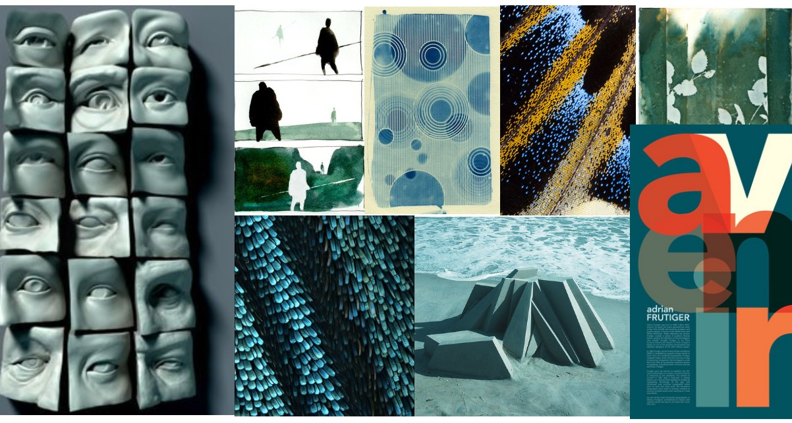

# portafolio-web
Portafolio Web Profesional | FELROM.CL

## ¿PARA QUÉ ES ESTA PROPUESTA?

Mostrar y presentar mi trabajo, procesos y proyectos recientes como diseñador integral. Además de mi perfil profesional, valores y flujo de trabajo.

## ¿PARA QUIÉNES ES ESTA PROPUESTA?

</img>
--- |
BRUNO NUÑEZ|
31 años|
Egresado de ingenieria está buscando emprender|
Necesita desarrollo de identidad gráfica para su pyme|
Trabaja y estudia, tiene nociones básicas de uso computacional pero no lo suficiente como para usar programas de edición|

</img>
--- |
IGNACIA ALVAREZ|
45 años| 
Agente de Marketing y publicidad para diseño web y publicitario| 
Busca de diseñadores para su plantilla en departamentos de dearrollo gráfico y creativo|

</img>
--- |
ANTONIA CARRASCO|
24 años|
Estudiante de postgrado|
Busca colegas dentro del ambito del diseño, compañeros para desarrollar proyectos freelance en conjunto|

## ¿QUÉ EXISTE QUE ES SIMILAR A LA PROPUESTA?

</img>| 
--- |
Portafolio Web Kia Ora, Diseñador |
https://kirschberg.co.nz |
 `lo positivo:` Animación y transiciones, scroll "eterno" en loop. | 
 `lo negativo:` Saturado de elementos. |

</img>| 
--- |
Portafolio web Olha Uzhykova, Diseñadora|
https://olhauzhykova.com/ |
 `lo positivo:` Uso de  animación con "fisicas" al scrollear. Animación de carga. | 
 
 </img>| 
--- |
WEB BJARKE INGELS GROUP, Arquitectos. |
https://big.dk/ |
 `lo positivo:` Simple, limpio, efecto en elemento de pantalla en el scroll. | 
 `lo negativo:` Aburrido y monótono. |
 
</img>| 
--- |
Portafolio web Zaha Hadid Architects |
https://www.zaha-hadid.com/ |
 `lo positivo:` Tablas de navegación "removibles" y desplazables. |

</img>| 
--- |
Empresa metalurgica Nordlog, pagina web.|
https://www.nordlog.com/en/?url=en |
 `lo positivo:` Efecto de multiplicar en el cursos, los juegos de elementos geométricos. Tipografía animada. |

</img>| 
--- |
Web Simon Lee "SpiderZero", diseñador, escultor y artista conceptual |
https://www.bigbluetree.com/artwork/ |
 `lo positivo:` Se presenta con referencias y comentarios de gente que ha trabajado con él.

## ¿QUÉ EXISTE QUE PUEDE INSPIRAR LA PROPUESTA?

</img>

