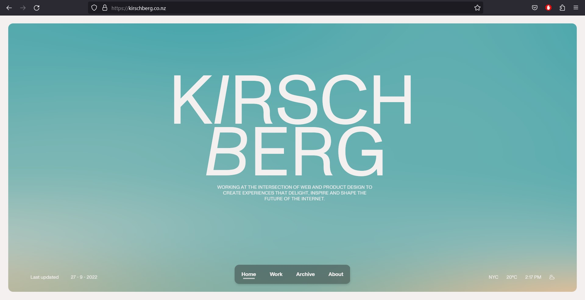
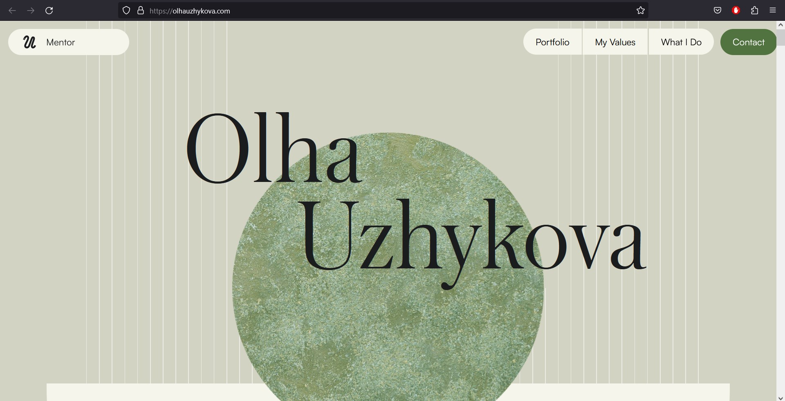
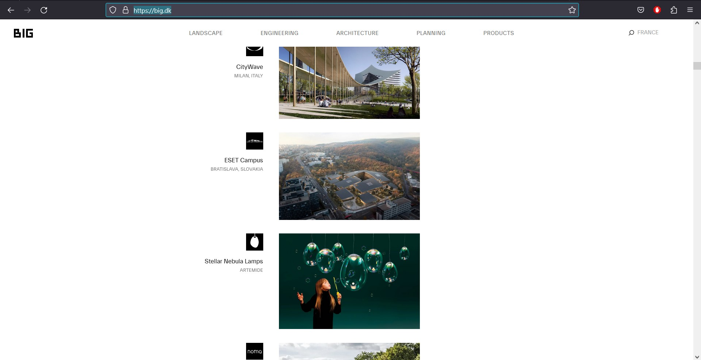
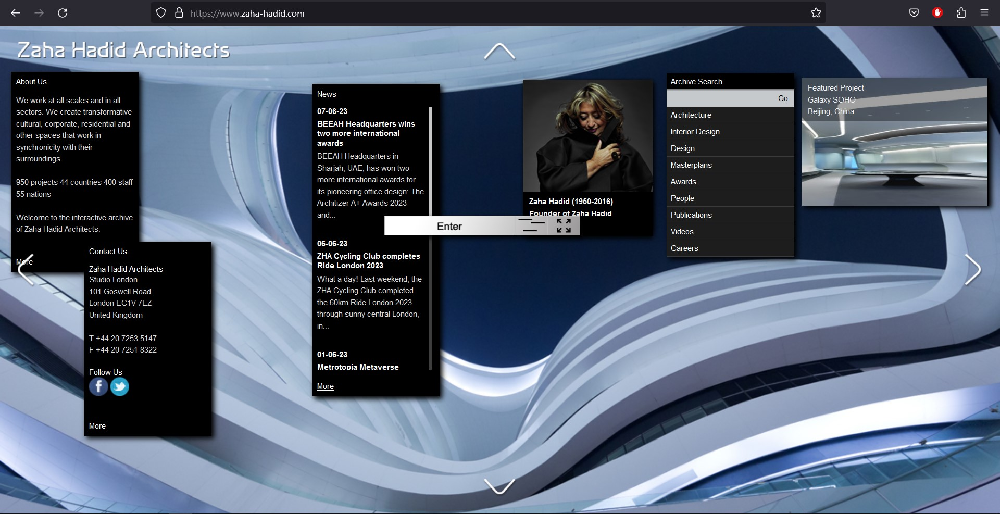
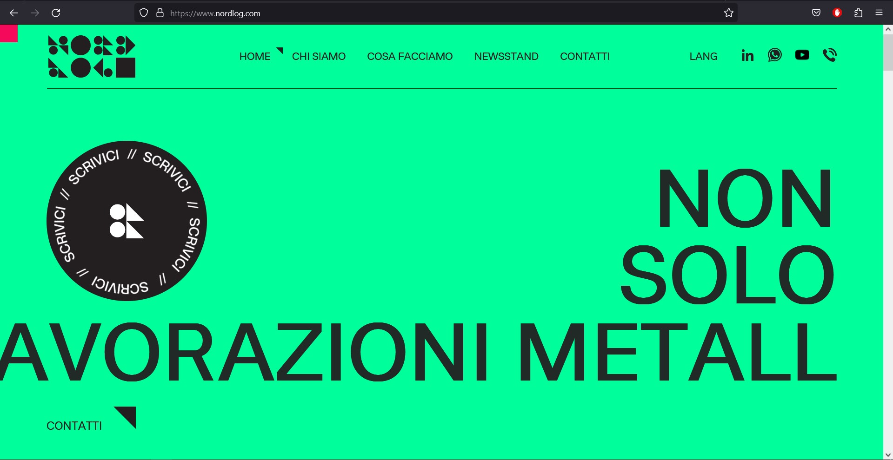
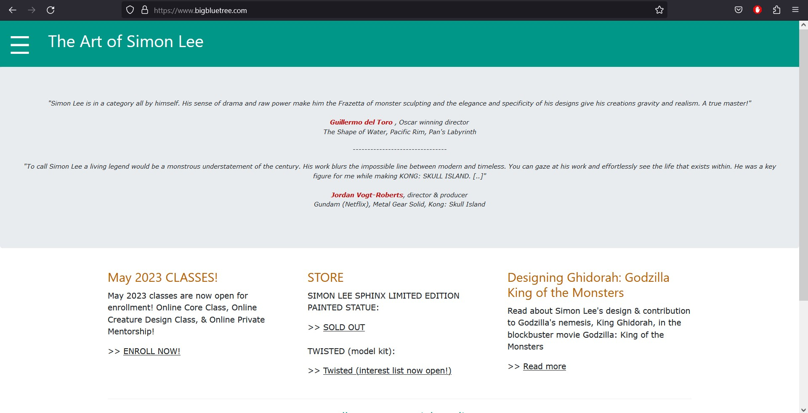

# portafolio-web
Portafolio Web Profesional | FELROM.CL

## ¿Para qué es esta propuesta?

Mostrar y presentar mi trabajo, procesos y proyectos recientes como diseñador integral. Además de mi perfil profesional, valores y flujo de trabajo.

## ¿Para quiénes es esta propuesta?

Emprendedores que necesiten desarrollo de identidad gráfica.

</img>

Agentes de Marketing y publicidad para diseño web y publicitario en busqueda de diseñadores para su plantilla.

</img>

Otros colegas dentro del ambito del diseño, compañeros para desarrollar proyectos freelance en conjunto.

</img>

## ¿Qué existe que es similar a la propuesta?

</img>| 
--- |
Portafolio Web Kia Ora, Diseñador |
https://kirschberg.co.nz |
 `lo positivo:` Animación y transiciones, scroll "eterno" en loop. | 
 `lo negativo:` Saturado de elementos. |

</img>| 
--- |
Portafolio web Olha Uzhykova, Diseñadora|
https://olhauzhykova.com/ |
 `lo positivo:` Uso de  animación con "fisicas" al scrollear. Animación de carga. | 
 
 </img>| 
--- |
WEB BJARKE INGELS GROUP, Arquitectos. |
https://big.dk/ |
 `lo positivo:` Simple, limpio, efecto en elemento de pantalla en el scroll. | 
 `lo negativo:` Aburrido y monótono. |
 
</img>| 
--- |
Portafolio web Zaha Hadid Architects |
https://www.zaha-hadid.com/ |
 `lo positivo:` Tablas de navegación "removibles" y desplazables. |

</img>| 
--- |
Empresa metalurgica Nordlog, pagina web.|
https://www.nordlog.com/en/?url=en |
 `lo positivo:` Efecto de multiplicar en el cursos, los juegos de elementos geométricos. Tipografía animada. |

</img>| 
--- |
Web Simon Lee "SpiderZero", diseñador, escultor y artista conceptual |
https://www.bigbluetree.com/artwork/ |
 `lo positivo:` Se presenta con referencias y comentarios de gente que ha trabajado con él.

## ¿Qué existe que puede inspirar la propuesta?

